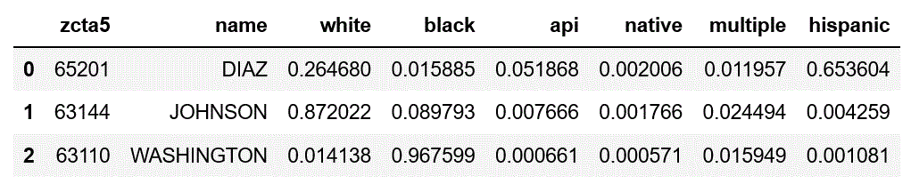

Surgeo
==============

|rtd_badge| |travis_badge| |shieldio_badge|

.. |rtd_badge| image:: https://readthedocs.org/projects/surgeo/badge/?version=master

.. |travis_badge| image:: https://travis-ci.org/theonaunheim/surgeo.svg?branch=master

.. |shieldio_badge| image:: https://badge.fury.io/py/surgeo.svg

The documentation for Surgeo may be found here: `<https://surgeo.readthedocs.io/en/master/>`_

Overview
--------

Surgeo is an open source Bayesian Improved Surname Geocode (BISG)
algorithm. In other words, Surgeo allows you to construct race
probabilities from commonly available data such as ZIP codes and surnames.
It is inspired by the work of the Consumer Financial Protection Bureau
(CFPB) and was initially created by Mark Elliot et al.

Please see the ReadTheDocs link above for information on the implementation
itself.

Installation
------------

To install surgeo as an executable, please see the installer below.

To install as a Python module, you can use pip:

.. code-block::

    $ pip install surgeo

Usage
-----

Surgeo can be used as a stand-alone executable or a Python module. Details
follow.

As a Program
~~~~~~~~~~~~

To use the GUI, simply type in "surgeo_gui" or use the Start Menu after
installing the executable.

.. code-block::

    $ surgeo_gui
    # Or alternatively if you have installed the module
    $ python -m surgeo

.. image:: ./static/gui_example.gif

To use the CLI, type in "surgeo" followed by your arguments.

.. code-block::

    $ surgeo_cli --help
    # Or alternatively if you have installed the module
    $ python -m surgeo -h

    usage: surgeo_cli [-h] [--zcta_column ZCTA_COLUMN]
                        [--surname_column SURNAME_COLUMN]
                        input output type

    Get Surgeo arguments.

    input                 Input CSV or XLSX of data.
    output                Output CSV or XLSX of data.
    type                  The model type being run ("sur", "geo" or "surgeo")

    optional arguments:
    -h, --help            show this help message and exit
    --zcta_column ZCTA_COLUMN
                        The input column to analyze as ZCTA/ZIP)
    --surname_column SURNAME_COLUMN
                        The input column to analyze as surname")

As a Module
~~~~~~~~~~~

Surgeo is best used as a module.

.. code-block:: python

    import pandas as pd
    import surgeo

    # Series of names
    names = pd.Series(['DIAZ', 'JOHNSON', 'WASHINGTON'])
    zctas = pd.Series(['65201', '63144', '63110'])

    # Create model
    model = surgeo.SurgeoModel()

    # Run model and get dataframe
    results = model.get_probabilities(names, zctas)

Prefab Files
------------

A link to the Windows GUI/CLI is below.

`Zipped Windows installer <https://github.com/theonaunheim/surgeo/releases/download/1.0.2/surgeo-win32.zip>`_.
