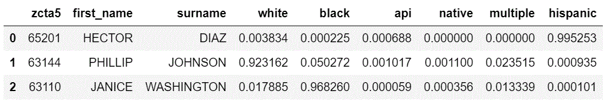

Usage
=====

Surgeo can be used as a stand-alone executable or a Python module. Details
on each of these approaches are addressed below.

As a Module
-----------

Surgeo is best used as a module with `pandas <pandas.pydata.org/>`_ and the
`Jupyter notebook <jupyter.org/>`_. The general workflow is to import surgeo,
then create a model, and then run the analysis using the `get_probabilities()`
method and the data being analyzed.

The available models are:

    1. `BIFSGModel`,  which takes a series of first names, a series of
       surnames, and a series of ZIP codes and gives the BIFSG results of
       those inputs (e.g. someone named HECTOR DIAZ in ZIP 79902 has a 80%
       probability of being hispanic).
    2. `FirstNameModel`, which uses a series of first names and gives the
       racial percentage of that first name (e.g. 92% of people with the
       first name AARON are white).
    3. `GeocodeModel`, which uses a series of ZIP codes and gives the
       racial percentage make up of that ZIP code (e.g. 81% of those people
       in ZIP 65201 are white).
    4. `SurnameModel`, which uses a series of surnames and gives the racial
       percentage of that surname (e.g. 5% of people with the surname DIAZ
       are white); and,
    5. `SurgeoModel`, which takes a series of surnames and a series of ZIP
       codes and gives the BISG results of those inputs (e.g. someone named
       DIAZ in ZIP 65201 has a 26% probability of being white).

.. code-block:: python

    import pandas as pd
    import surgeo

    # Instatiate your model (or all five)
    fsg = surgeo.BIFSGModel()
    sg = surgeo.SurgeoModel()
    f = surgeo.FirstNameModel()
    g = surgeo.GeocodeModel()
    s = surgeo.SurnameModel()

    # Create pd.Series objects to analze (or load them)
    first_names = pd.Series(['HECTOR', 'PHILLIP', 'JANICE'])
    surnames = pd.Series(['DIAZ', 'JOHNSON', 'WASHINGTON'])
    zctas = pd.Series(['65201', '63144', '63110'])

    # Get results using the get_probabilities() function
    fsg_results = fsg.get_probabilities(first_names, surnames, zctas)
    sg_results = sg.get_probabilities(surnames, zctas)
    f_results = f.get_probabilities(first_names)
    g_results = g.get_probabilities(zctas)
    s_results = s.get_probabilities(surnames)

    # Show Surgeo BIFSG results
    fsg_results

As a Program
------------

To use the GUI, type in "surgeo_gui" into your shell or open the
application after installation in your Start Menu (Windows only).

Simply supply the input and output file paths as required and then select
the model type. Then select any column names in your .xlsx/.csv associated
with surname/ZIP, and click "Execute". The results will be written to the
output file.

.. code-block::

    $ surgeo_gui
    # Or alternatively if you have installed the module
    $ python -m surgeo

.. image:: ./_static/gui_example.gif

To use the CLI, type in "surgeo_cli" followed by your arguments. The first
argument is the input file path, the second argument is the output file
path, and the third argument is the model being used. There are also
optional argument to define the name of the ZCTA and surname columns if
they are not the defaults. The default values are:

1. "zcta5" for geographical area;
2. "name" for surname; and,
3. "first_name" for first name.

.. code-block::

    $ surgeo_cli --help
    # Or alternatively if you have installed the module
    $ python -m surgeo -h

    usage: surgeo_cli [-h] [--zcta_column ZCTA_COLUMN]
                        [--first_name_column FIRST_NAME_COLUMN]
                        [--surname_column SURNAME_COLUMN]
                        input output type

    Get Surgeo arguments.

    input                 Input CSV or XLSX of data.
    output                Output CSV or XLSX of data.
    type                  The model type being run ("bifsg", "first_name", "sur", "geo" or "surgeo")

    optional arguments:
    -h, --help            show this help message and exit
    --zcta_column ZCTA_COLUMN
                        The input column to analyze as ZCTA/ZIP)
    --first_name_column SURNAME_COLUMN
                        The input column to analyze as first name")
    --surname_column SURNAME_COLUMN
                        The input column to analyze as surname")
